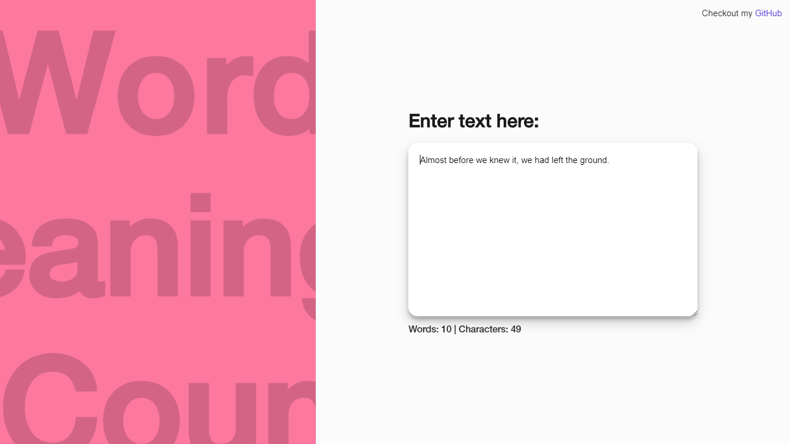

# Word Counter
[Live Demo](https://edumigueis.github.io/Word-Counter/)
> Javascript implementation that counts characters and words in a text provided by the user. Interface made using JS, SCSS and GSAP.

This project presents a js text reading algorithm that counts characters and words from a given text along-side a user interface. Animations were made using TimelineLite from GSAP. 

## Meta

Eduardo Migueis

Distributed under the MIT license. See ``LICENSE`` for more information.

[https://github.com/edumigueis/Word-Counter](https://github.com/edumigueis)
